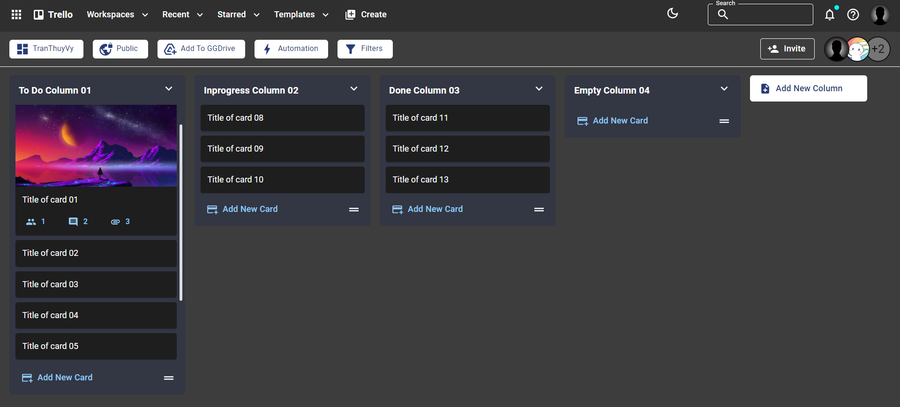
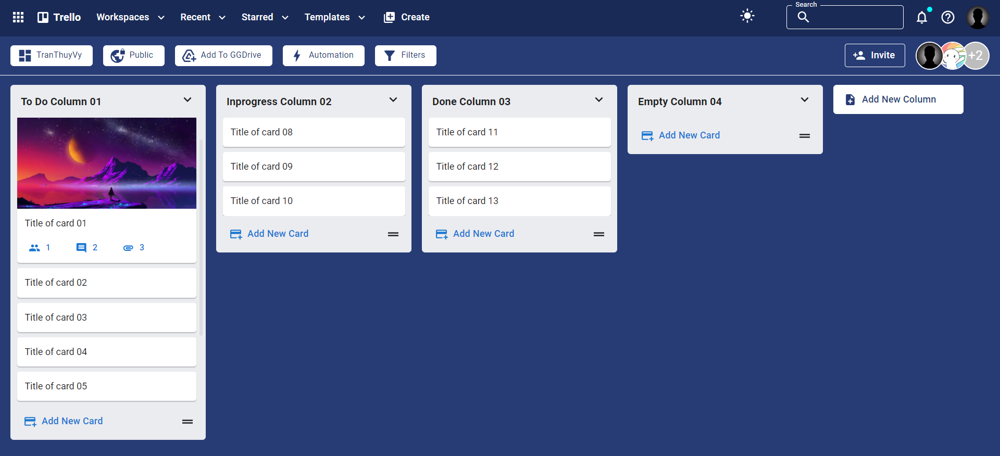

# Trello Website

# Introduction

- A website built based on Trello, utilizing Vite for fast performance. User interface developed with ReactJs and Material

# My Projects

    
    

 

# Using

- Vercel: Hosting Services
- Tailwind CSS, Material: Format Style
- React: Front-End
- Git & Github: Version Control

# Install, Run
- yarn || npm install
- yarn dev || npm run dev

[website]: https://ttv-trello.vercel.app/
